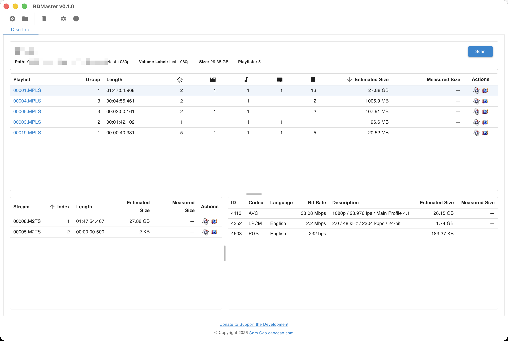

# BDMaster

  

A modern GUI for inspecting Blu-ray disc.

## Features

* Linux (x86_64) + MacOS (x86_64 + arm64) + Windows (x86_64)
* Drag and drop Blu-ray disc or folder
* Disc, playlist, stream, track information, bit rate graph, etc.
* Integrate with [BetterMediaInfo](https://github.com/caoccao/BetterMediaInfo)
* Integrate with [MKVToolNix](https://mkvtoolnix.download/)

## Documentation

* [Screenshots](docs/screenshots/README.md)
* [Release Notes](docs/release_notes.md)

## License

[APACHE LICENSE, VERSION 2.0](LICENSE)
