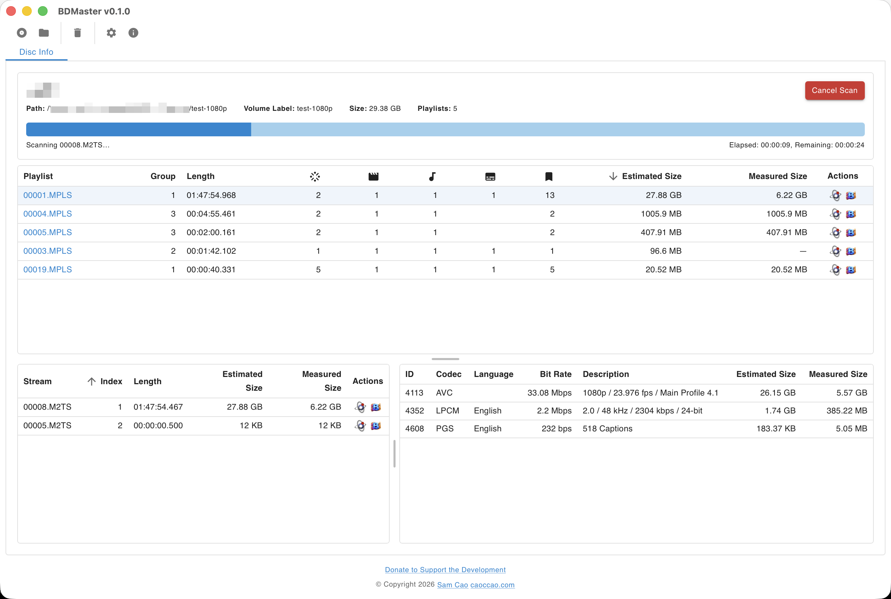
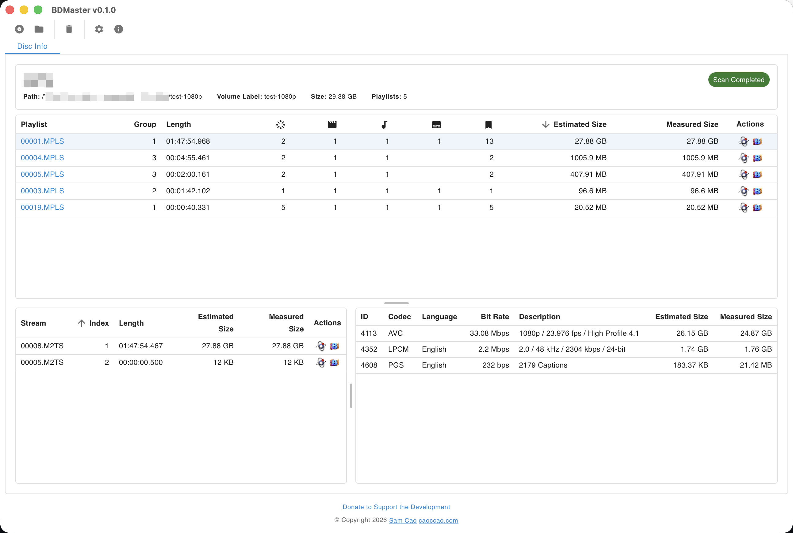
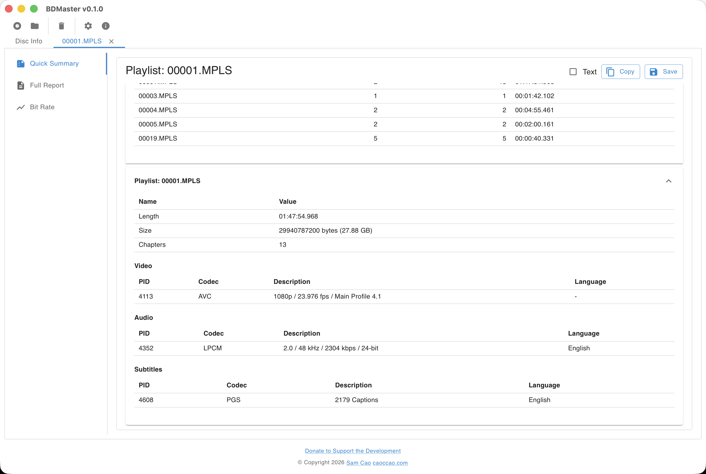
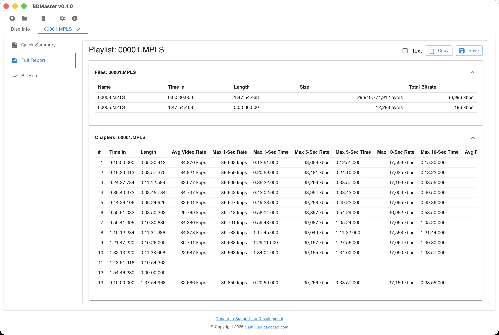
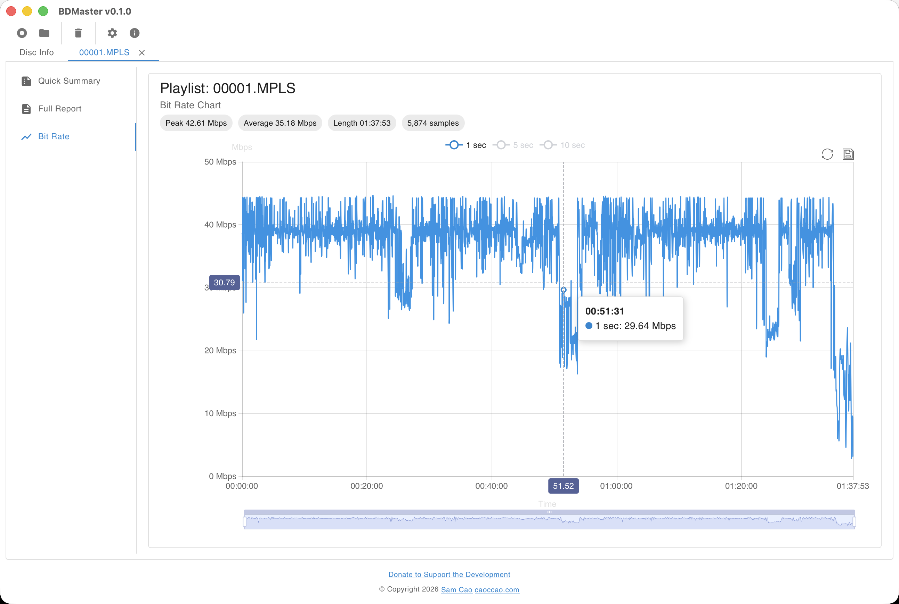

# BDMaster — A Visual Tour

BDMaster is a modern, cross-platform GUI for inspecting Blu-ray discs. Walk through the app step by step below.

## 1. Open a Disc

Launch BDMaster and drag a Blu-ray folder or `.iso` image onto the window — or pick one through the toolbar. The disc is parsed immediately and the **Disc Info** tab presents the structure: playlists on the left, plus disc-level metadata and the playlist / stream / clip breakdown.

## 2. Start a Full Scan

For accurate sizes and bit rates, kick off a **Full Scan**. BDMaster reads every M2TS stream end-to-end in the background, reporting live progress with elapsed and estimated-remaining time. The scan can be cancelled at any moment, and it stops cleanly if the window is closed mid-run.

## 3. Review the Scanned Disc

Once the full scan finishes, every playlist, clip, and track is updated with measured sizes and refined bit rates. Sort playlists by duration, video / audio / subtitle / chapter counts, and drill into any stream from the same view.

## 4. Read the Quick Summary

Pick a playlist and switch to **Quick Summary** for a compact, BDInfo-style overview — runtime, total size, video / audio / subtitle tracks, and chapter counts — fully localized into all supported languages.

## 5. Generate the Full Report

The **Full Report** tab produces a complete, copy-and-paste-friendly report with per-stream details. Save it to a text file straight from the UI, or open the playlist (or any individual stream) in **MKVToolNix** or **BetterMediaInfo** for deeper inspection.

## 6. Visualize the Bit Rate

The **Bit Rate** tab plots the bit-rate curve collected during the full scan, powered by Apache ECharts. Zoom, pan, and export the chart as a PNG to share or archive.

